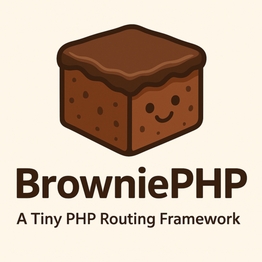

# BrowniePHP



## A Tiny PHP Routing Framework

BrowniePHP is a lightweight PHP routing framework, inspired by Express.js, that provides a simple and intuitive way to handle HTTP requests and define routes for your web applications. It aims to be minimalistic yet powerful, allowing you to quickly build RESTful APIs or handle various HTTP methods with ease.

## Features

- Define routes using HTTP methods (GET, POST, PATCH, PUT, DELETE)
- Handle middleware functions for request preprocessing
- Extract parameters from route URLs
- Parse JSON request bodies automatically
- Access request context and headers easily
- Simple and easy to integrate with existing PHP projects

## Installation

You can install BrowniePHP using Composer. Run the following command in your project directory:

```bash
composer require emant/brownie-php
```

## Getting Started

To define a route, create an instance of the `Router` class and use the appropriate method based on the desired HTTP method:

```php
use Emant\BrowniePhp\Router;

$router = new Router();

$router->get('/users', function ($ctx) {
    // Handle GET /users request
});

$router->post('/users', function ($ctx) {
    // Handle POST /users request
});

$router->put('/users/{id}', function ($ctx) {
    // Handle PUT /users/{id} request
    // Access the {id} parameter using $ctx['params']['id']
});

// ... Define more routes
```

You can add global middleware functions using the `use` method:

```php
$router->use(function ($ctx) {
    // Perform preprocessing logic here
    // Access request context via $ctx array
});
```

The `Router` class provides an `all` method, which allows you to define a route that matches all HTTP methods. This means that any incoming request, regardless of the HTTP method used, will be matched.
It provides a convenient way to handle common functionality or apply middleware , regardless of the specific method.

```php
$router->all('/common-route', function ($ctx) {
    // Common logic or middleware for all routes
});
```

To start the routing process, call the run method:

```php
$router->run();
```

This will match the incoming request to the defined routes and execute the corresponding route handler or middleware functions.

Inside the route handler or middleware functions, the request context is available as an associative array named `$ctx`. You can access various request properties such as method, path, query parameters, request body, and headers through this array.

## Mounting a Nested Router

The `all` method provided by the `Router` class allows you to mount a nested router on a specific path. This is useful when you want to group related routes together under a common prefix or when you want to delegate the handling of certain routes to a separate router instance.

To mount a nested router, follow these steps:

1. Create an instance of the nested router using the `Router` class constructor.

```php
$nestedRouter = new Router();

$nestedRouter->get('/subroute', [$controller, 'index']);
$nestedRouter->post('/subroute', [$controller, 'create']);
// Add more routes as needed...
```

2. Mount the nested router on a specific route of the main router using the all method.

```php
$mainRouter = new Router();

$mainRouter->all('/prefix', [$nestedRouter, 'run']);

$mainRouter->get('/home', [$homeController, 'index']);
$mainRouter->post('/users', [$userController, 'create']);
// ...
```

3. Run the main router to start processing incoming requests.

```php
$mainRouter->run();
```

## Utils Class

The Utils class in BrowniePHP provides a collection of utility methods that offer functionality commonly used in web development. Here are some key methods available in the class:

`send_json($data)`

This method sends JSON-encoded data as a response to the client. It supports JSONP by checking for a callback parameter in the request URL. If the parameter is present, the response is wrapped in a callback function. Otherwise, the response is sent as standard JSON. This method can be used to send JSON data back to the client in a consistent and structured manner.

`enable_cors($origin = '*')`

This method enables Cross-Origin Resource Sharing (CORS) by setting the necessary headers in the response. It allows requests from different origins to access the resources of your application. The $origin parameter specifies the allowed origin or origins. By default, it is set to '\*', allowing requests from any origin. The method sets the `Access-Control-Allow-Origin, Access-Control-Allow-Credentials, Access-Control-Allow-Headers, and Access-Control-Allow-Methods` headers accordingly.

### Error Handlers

The Utils class also includes error handler methods that simplify the process of returning error responses. These methods facilitate sending error messages and appropriate HTTP status codes to the client.

`server_error($error_type, $description, $status_code)`

This method generates an error response with a specified error type, description, and HTTP status code. It constructs an associative array with the error details and sets the appropriate status code. The error response is then sent as JSON using the `send_json` method.

`unknown_error()`

The unknown_error method is a convenience wrapper for the `server_error` method. It simplifies handling internal server errors by providing a pre-defined error type, description, and HTTP status code.

`not_found()`

Similar to the `unknown_error` method, `not_found` is a convenience wrapper for the `server_error` method. It simplifies handling resource not found errors by providing a pre-defined error type, description, and HTTP status code.

## Contributing

Contributions are welcome! If you find any issues or have suggestions for improvements, please open an issue or submit a pull request on the [GitHub repository](https://github.com/Em-Ant/brownie-php).

## License

BrowniePHP is open-source software licensed under the [MIT license](https://opensource.org/license/mit/).
